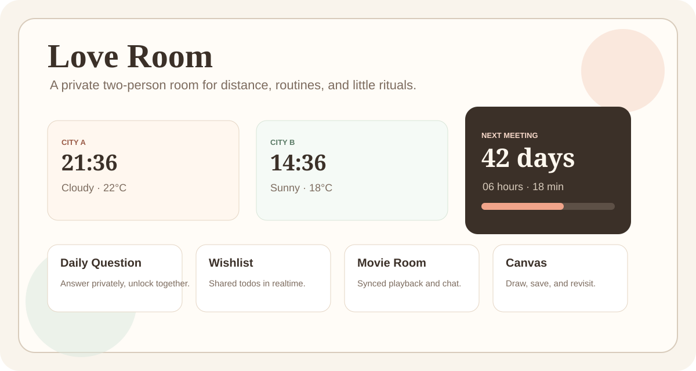
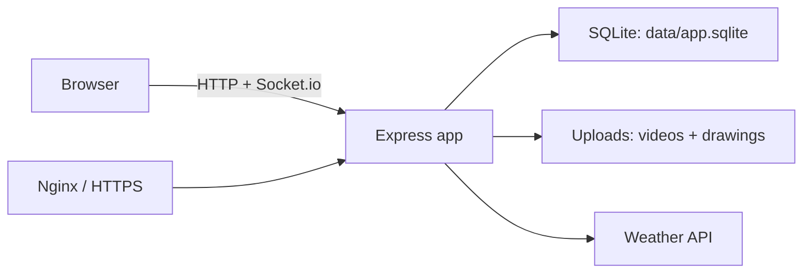

# Love Room



Love Room is a warm, self-hosted two-person web app for long-distance couples or close friends. It is private-path and passcode based: no registration system, no SaaS backend, no third-party database.

## Features

- Dual-city dashboard with clocks, dates, weather, outfit hints, and meeting countdown
- Shared wishlist / todo list with realtime Socket.io sync
- Daily question: each person answers privately, both answers unlock together
- Countdown page for the next meeting, birthdays, and anniversaries
- Synced movie room with playback sync, local uploads, external video URLs, chat, and presence
- Shared canvas with realtime drawing, undo, eraser, save, and gallery
- Stamp book for daily visits and streak badges
- Private draw-and-guess game built with Canvas and Socket.io
- Browser first-run setup for names, emojis, passcodes, cities, time zones, birthdays, and meeting info

## Stack

- Node.js + Express
- Socket.io
- SQLite
- Plain HTML/CSS/JavaScript
- Local filesystem uploads
- Open-Meteo by default; optional OpenWeatherMap API key

## Prerequisites

- Node.js 20 LTS recommended
- npm
- Linux/macOS/Windows supported for local use
- For some platforms, `better-sqlite3` may need native build tools if a prebuilt binary is unavailable

## Quick Start

macOS / Linux:

```bash
npm ci
cp .env.example .env
npm run init-db
npm start
```

Windows PowerShell:

```powershell
npm.cmd ci
Copy-Item .env.example .env
npm.cmd run init-db
npm.cmd start
```

Open:

```text
http://localhost:3000/love-room-demo
```

On first open, the app shows a setup form. Fill in the two people, passcodes, cities, time zones, optional birthdays, and next meeting details. Weather coordinates are resolved automatically from city names, so most users do not need latitude or longitude.

## What Still Belongs In `.env`

Most personal room details are configured in the browser. Keep server-level values in `.env`.

| Variable | Required | Default | Notes |
| --- | --- | --- | --- |
| `NODE_ENV` | No | `development` | Use `production` on servers. |
| `PORT` | No | `3000` | App listen port. |
| `HOST` | No | `127.0.0.1` | Use `0.0.0.0` only if you want direct network access. |
| `BASE_URL` | No | `http://localhost:3000` | Public site URL for docs/integrations. |
| `ROOM_PATH` | Recommended | `/love-room-demo` | Change before public deployment. |
| `DB_PATH` | No | `data/app.sqlite` | SQLite file path. |
| `WEATHER_PROVIDER` | No | `openmeteo` | `openmeteo` or `openweathermap`. |
| `WEATHER_API_KEY` | If OpenWeatherMap | empty | Not needed for Open-Meteo. |
| `MAX_VIDEO_MB` | No | `500` | Upload size limit. |
| `ROOM_SECRET` | Yes in production | dev placeholder | Generate a long random string. |
| `VTT_URL` | No | empty | Optional external VirtualTabletop link. |
| `POSIO_URL` | No | empty | Optional external Posio link. |
| `TRUST_PROXY` | Behind proxy | `0` | Set `1` behind Nginx. |

Optional seed variables such as `PERSON_A_NAME` and `CITY_A_NAME` exist for scripted deployments, but most users should leave them out and use the browser setup.

## Architecture



## Deployment Sketch

```bash
sudo mkdir -p /opt/love-room
sudo chown "$USER":"$USER" /opt/love-room
git clone https://github.com/your-name/love-room.git /opt/love-room
cd /opt/love-room
npm ci --omit=dev
cp .env.example .env
# Edit .env: NODE_ENV=production, ROOM_PATH, ROOM_SECRET, BASE_URL, TRUST_PROXY=1
npm run init-db
npm start
```

Then open the private room path and complete the browser setup.

## PM2

```bash
npm install -g pm2
pm2 start ecosystem.config.cjs
pm2 save
pm2 startup
```

## systemd

Create `/etc/systemd/system/love-room.service`:

```ini
[Unit]
Description=Love Room
After=network.target

[Service]
Type=simple
WorkingDirectory=/opt/love-room
EnvironmentFile=/opt/love-room/.env
ExecStart=/usr/bin/node src/server.js
Restart=always
RestartSec=3
User=love-room
Group=love-room

[Install]
WantedBy=multi-user.target
```

Then:

```bash
sudo systemctl daemon-reload
sudo systemctl enable --now love-room
sudo systemctl status love-room
```

## Nginx Reverse Proxy

```nginx
server {
    listen 80;
    server_name your-domain.example.com;

    location / {
        proxy_pass http://127.0.0.1:3000;
        proxy_http_version 1.1;
        proxy_set_header Host $host;
        proxy_set_header X-Real-IP $remote_addr;
        proxy_set_header X-Forwarded-For $proxy_add_x_forwarded_for;
        proxy_set_header X-Forwarded-Proto $scheme;
        proxy_set_header Upgrade $http_upgrade;
        proxy_set_header Connection "upgrade";
    }
}
```

For HTTPS, add Certbot or your preferred certificate manager.

## Backup

Back up:

- `data/app.sqlite`
- `uploads/drawings`
- optionally `uploads/videos` if you want to preserve uploaded movies

Example:

```bash
APP_DIR=/opt/love-room BACKUP_ROOT=/opt/love-room-backups bash scripts/backup.sh
```

## Troubleshooting

- `Set ROOM_SECRET before running in production.`  
  Set a real `ROOM_SECRET` in `.env`, for example `openssl rand -hex 32`.

- Socket.io does not connect behind Nginx  
  Check `Upgrade` and `Connection` headers and set `TRUST_PROXY=1`.

- Weather shows the wrong place  
  Make the city name more specific, or use Settings -> Advanced weather coordinates.

- `.env` city changes do not update the app  
  First-run settings are stored in SQLite. Change them in the browser Settings page or reset the database.

- Windows PowerShell refuses `npm`  
  Use `npm.cmd` commands as shown in Quick Start.

## Security Notes

- Do not commit `.env`, SQLite databases, private keys, uploads, backups, or real Nginx configs.
- Change `ROOM_PATH` before exposing the app to the internet.
- Complete browser setup before sharing the URL. While setup is incomplete, anyone with the room path can claim the initial configuration.
- Uploaded files under `/uploads` are served statically by the app. Do not upload content you would not want accessible to someone who has the URL.
- This project is private-path/passcode based. It is not a full account system.

## Public Repo Checklist

```bash
git add -n .
rg --glob '!node_modules/**' --glob '!data/**' --glob '!uploads/**' "your-real-domain|your-real-ip|real-passcode|real-room-path"
```

Only commit source code, docs, `.env.example`, `.gitignore`, lockfile, license, and `.gitkeep` placeholders.

## License

MIT
