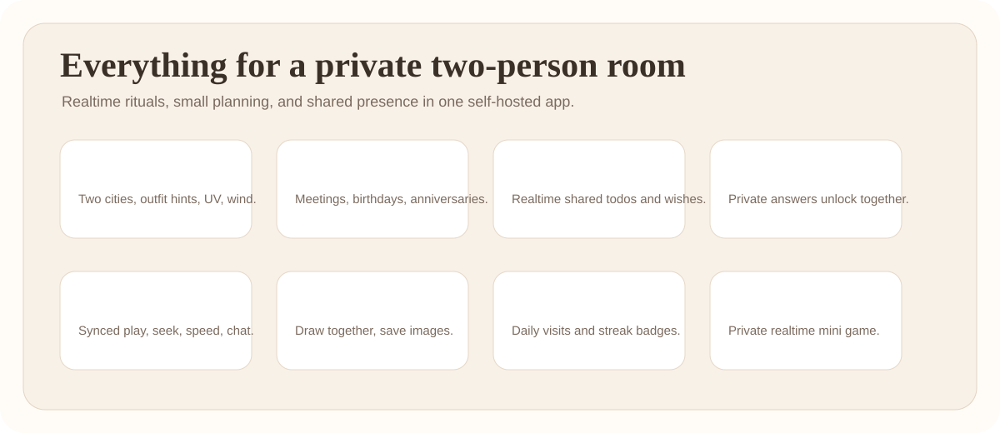
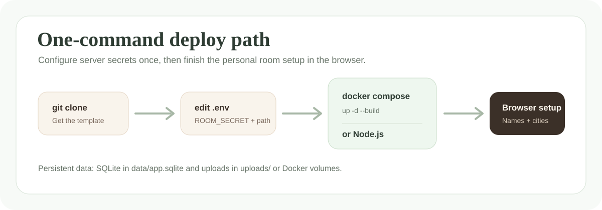

<p align="center">
  <a href="./README.md">简体中文</a>
  ·
  <a href="./README.zh-Hant.md"><strong>繁體中文</strong></a>
  ·
  <a href="./README.en.md">English</a>
</p>

# Love Room

一個溫暖、乾淨、可自託管的雙人私密 Web App。適合異地情侶、親密朋友，或者任何只想和一個人共享日常小空間的人。


## 它是什麼

Love Room 不是社交平台，也不是帳號系統。它只有一個私密訪問路徑和兩個房間口令。你把它部署在自己的伺服器上，資料保存在自己的 SQLite 和本機上傳目錄裡。

第一次打開網頁時，會出現初始化表單。使用者可以在網頁端填寫：

- 兩個人的顯示名、emoji 和口令
- 兩個城市、時區、生日
- 下次見面時間、地點、倒數標題

經緯度不用手填。天氣會根據城市名自動解析座標；如果自動解析不準，再到設定頁的進階項手動覆蓋。

## 功能一覽



- 雙城 Dashboard：時間、日期、天氣、體感溫度、風速、UV、穿搭建議
- 下次見面倒數：主倒數、生日、紀念日、自訂紀念日
- 共享心願清單：即時同步新增、編輯、完成、刪除
- 今天的你：雙方回答前互不可見，雙方提交後解鎖
- 電影同步房間：影片連結、本機上傳、播放/暫停/進度/倍速同步、聊天
- 共同畫板：即時畫畫、橡皮擦、撤銷、清空、保存圖片
- 蓋印冊：每日郵戳、連續天數、月度查看、歷史記錄
- 你畫我猜：私人即時小遊戲
- 更多入口：可配置 VirtualTabletop / Posio 外部遊戲連結

## 技術棧

- Node.js + Express
- Socket.io
- SQLite
- 原生 HTML / CSS / JavaScript
- Open-Meteo 預設天氣源，可選 OpenWeatherMap
- 本機檔案上傳，適合自託管

## 快速開始

推薦 Node.js 20 LTS。

macOS / Linux:

```bash
npm ci
cp .env.example .env
npm run init-db
npm start
```

Windows PowerShell:

```powershell
npm.cmd ci
Copy-Item .env.example .env
npm.cmd run init-db
npm.cmd start
```

打開：

```text
http://localhost:3000/love-room-demo
```

然後在網頁裡完成首次配置。

## 一鍵部署支援

支援 Docker Compose。嚴格來說，公開部署前仍需要先改一次 `.env` 裡的伺服器級秘密，例如 `ROOM_SECRET` 和 `ROOM_PATH`；之後可以一條命令啟動。



```bash
git clone https://github.com/Python-PIG/love-room.git
cd love-room
cp .env.example .env
# 編輯 .env：至少修改 ROOM_SECRET，部署公網時也建議修改 ROOM_PATH
docker compose up -d --build
```

查看日誌：

```bash
docker compose logs -f
```

停止：

```bash
docker compose down
```

Docker Compose 會使用 volume 保存：

- SQLite 資料庫：`/app/data`
- 上傳檔案：`/app/uploads`

所以重建容器不會丟資料。

## `.env` 還需要做什麼

大多數個人化資訊已經移到網頁端。`.env` 只保留伺服器級配置。

| 變數 | 必填 | 預設值 | 說明 |
| --- | --- | --- | --- |
| `NODE_ENV` | 否 | `development` | 生產環境用 `production` |
| `PORT` | 否 | `3000` | Node 服務埠 |
| `HOST` | 否 | `127.0.0.1` | Nginx 反代推薦保持預設；直連區網可改 `0.0.0.0` |
| `BASE_URL` | 否 | `http://localhost:3000` | 你的公開訪問地址 |
| `ROOM_PATH` | 建議 | `/love-room-demo` | 私密路徑，公開部署前建議修改 |
| `DB_PATH` | 否 | `data/app.sqlite` | SQLite 檔案位置 |
| `WEATHER_PROVIDER` | 否 | `openmeteo` | 可選 `openmeteo` 或 `openweathermap` |
| `WEATHER_API_KEY` | 視情況 | 空 | OpenWeatherMap 才需要 |
| `MAX_VIDEO_MB` | 否 | `500` | 影片上傳大小限制 |
| `ROOM_SECRET` | 生產必填 | 範例值 | 生產環境必須換成長隨機字串 |
| `VTT_URL` | 否 | 空 | 更多頁裡的 VirtualTabletop 連結 |
| `POSIO_URL` | 否 | 空 | 更多頁裡的 Posio 連結 |
| `TRUST_PROXY` | 反代時 | `0` | Nginx / 反代後建議設為 `1` |

生成 `ROOM_SECRET`：

```bash
openssl rand -hex 32
```

## 傳統 Node 部署

```bash
sudo mkdir -p /opt/love-room
sudo chown "$USER":"$USER" /opt/love-room
git clone https://github.com/Python-PIG/love-room.git /opt/love-room
cd /opt/love-room
npm ci --omit=dev
cp .env.example .env
# 編輯 .env：NODE_ENV=production、ROOM_SECRET、ROOM_PATH、BASE_URL
npm run init-db
npm start
```

## PM2

```bash
npm install -g pm2
pm2 start ecosystem.config.cjs
pm2 save
pm2 startup
```

## Nginx 反向代理

```nginx
server {
    listen 80;
    server_name your-domain.example.com;

    location / {
        proxy_pass http://127.0.0.1:3000;
        proxy_http_version 1.1;
        proxy_set_header Host $host;
        proxy_set_header X-Real-IP $remote_addr;
        proxy_set_header X-Forwarded-For $proxy_add_x_forwarded_for;
        proxy_set_header X-Forwarded-Proto $scheme;
        proxy_set_header Upgrade $http_upgrade;
        proxy_set_header Connection "upgrade";
    }
}
```

如果用 Nginx，請在 `.env` 中設定：

```env
TRUST_PROXY=1
```

HTTPS 可以用 Certbot 或你喜歡的憑證方案。

## 備份

需要備份：

- `data/app.sqlite`
- `uploads/drawings`
- 如果你想保留上傳影片，也備份 `uploads/videos`

示例：

```bash
APP_DIR=/opt/love-room BACKUP_ROOT=/opt/love-room-backups bash scripts/backup.sh
```

## 常見問題

**生產啟動時出現 `Set ROOM_SECRET before running in production.`**
說明你還沒有設定真實 `ROOM_SECRET`，或者仍在使用範例值。

**天氣城市不準怎麼辦？**
先把城市名寫具體一點，例如加國家或地區。如果仍不準，到設定頁展開 `Advanced weather coordinates` 手動填經緯度。

**改了 `.env` 裡的城市，網頁沒變？**
首次配置會寫入 SQLite。之後請在網頁設定頁修改；或者刪除資料庫重新初始化。

## 安全邊界

- 不要提交 `.env`、SQLite 資料庫、上傳檔案、備份、私鑰、真實 Nginx 配置。
- 公網部署前請修改 `ROOM_PATH`。
- 首次 setup 完成前，只要知道房間路徑的人都可能初始化房間；請先完成 setup 再分享地址。
- `/uploads` 下檔案會被靜態訪問，不要上傳真正敏感的內容。
- 這是私密路徑 + 口令方案，不是完整帳號系統。

## License

MIT
